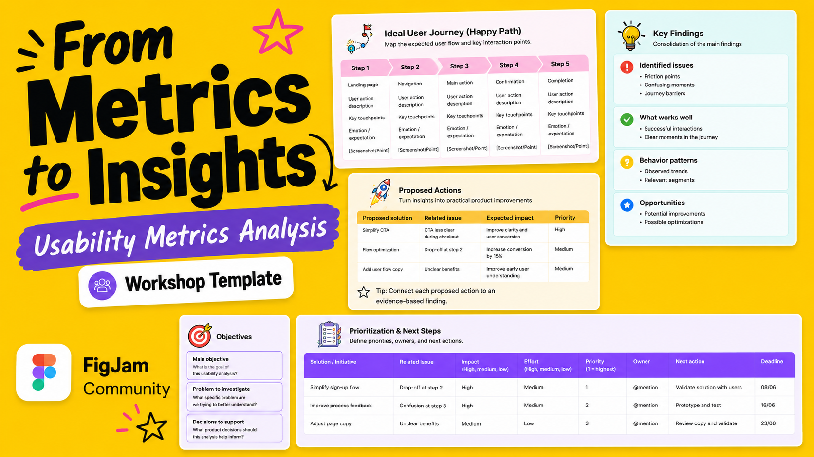

# Usability Metrics Analysis Canvas

A collaborative FigJam template that helps UX, Product, Data, and Engineering teams turn usability metrics into clear insights and actionable product decisions.

## Preview

## Duplicate the template

Use the FigJam template here:

[Open and duplicate the Usability Metrics Analysis Canvas](https://www.figma.com/community/file/1649917900624109717)

## What it includes

- Analysis goals
- Project team
- Success metrics
- Initiative timeline
- Ideal user journey / happy path
- Key findings
- Proposed actions
- Evidence and sources
- Prioritization and next steps

## How to use it

Start with the **Preparation** section to define the goal, team, success metrics, and timeline.

Move to the **Analysis** section to map the ideal user journey, gather evidence, synthesize key findings, and propose improvements.

Finish with the **Action** section to prioritize next steps based on impact, effort, ownership, and urgency.

## Adapt it to your context

The examples in this template are starting points. Replace, remove, or adapt the metrics, sections, and prompts based on your product, user journey, research goals, and business context.

Duplicate cards, rows, or sections as needed, and remove anything that does not apply to your analysis.

## Best for

- Usability testing reports
- Product audits
- Funnel analysis
- Dashboard reviews
- UX research synthesis
- Stakeholder workshops
- Post-launch reviews

## Created by

**Kethleen Holthausen Bruno**  
UX Researcher & Product Designer

Feedback is welcome. I’d love to hear what worked, what didn’t, and what could be improved.

[Connect with me on LinkedIn](https://www.linkedin.com/in/kethleenbruno/)

## License

This project will be shared under the Creative Commons Attribution 4.0 International License (CC BY 4.0).

You are free to use, share, and adapt this template, including for commercial purposes, as long as appropriate credit is given.
